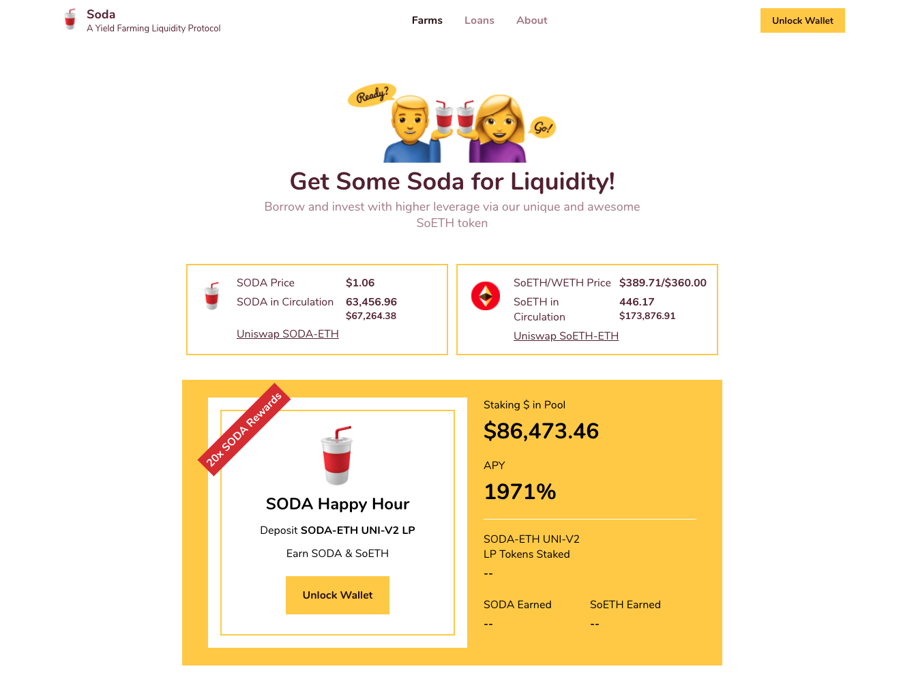
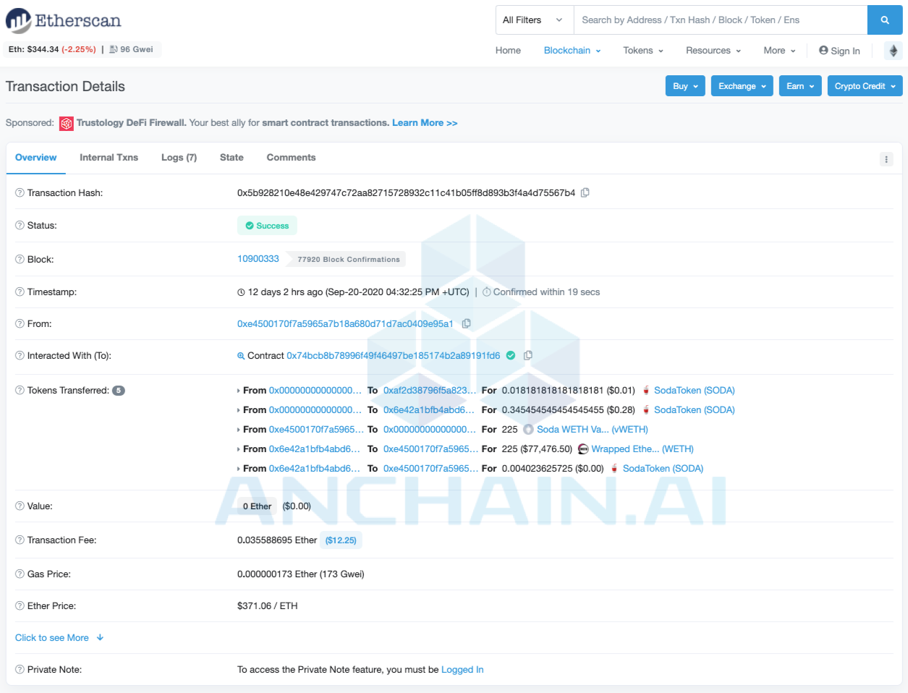
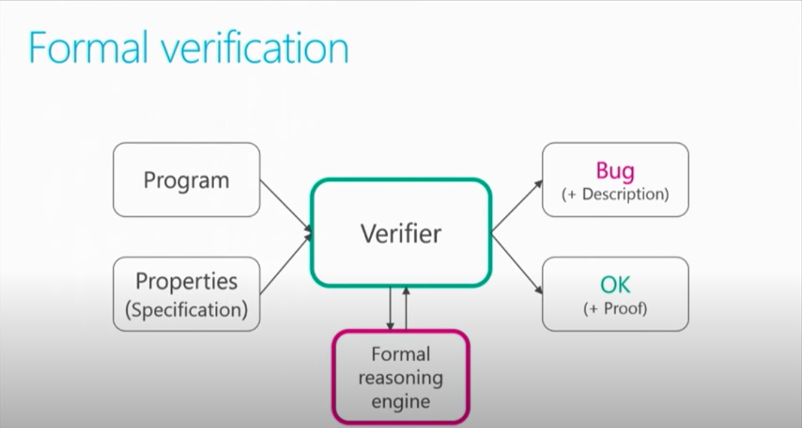

# Soda Finance Hack: Could Formal Verification Have Prevented It? (Code Included)

AnChain.AI  Team. 2020/10/1

#### Background

On Sep 20, 2020, the liquidity mining project DeFi [Soda.Finance](https://soda.finance/) was hacked by malicious actors, who subsequently liquidated over 400 ETH (around $160,000) from the Soda loan pool. In this blog, we will walk thru the hack incident, and show how we can apply formal verification to prevent.



 Here are some screenshots of the hacking transactions:




To everyone's surprise, the loophole exploited by the hackers was simply a mistakenly written variable in the [WETHCalculator.sol](https://github.com/soda-finance/soda-contracts/blob/master/contracts/calculators/WETHCalculator.sol) smart contract. Let's dive in and see how a seemingly tiny issue caused this huge loss.


#### Where Is The Bug ?!

The buggy variable was ***amount*** in line 193 of [WETHCalculator.sol](https://github.com/soda-finance/soda-contracts/blob/master/contracts/calculators/WETHCalculator.sol). According to the Soda.Finance blog, this variable should be replaced by ***lockedAmount***, which is exactly how the Soda team fixed this bug in line 300 of [WETHCalculatorFixed.sol](https://github.com/soda-finance/soda-contracts/blob/master/contracts/calculators/WETHCalculatorFixed.sol)

```mathematica
uint256 maximumLoan = loanInfo[_loanId].amount.mul(loanInfo[_loanId].maximumLTV).div(LTV_BASE);
```

<center><b><i>WETHCalculator.sol</i></b></center>

```mathematica
uint256 maximumLoan = loanInfoFixed[_loanId].lockedAmount.mul(loanInfoFixed[_loanId].maximumLTV).div(LTV_BASE);
```

<center><b><i>WETHCalculatorFixed.sol</i></b></center>

The consequence of this mistake was that for whatever input, the following requirement check in line 196 of [WETHCalculator.sol](https://github.com/soda-finance/soda-contracts/blob/master/contracts/calculators/WETHCalculator.sol) would pass, enabling everyone, including hackers to call the ***collectDebt()*** function to liquidate WETH stored in the pool.

```mathematica
require(loanTotal >= maximumLoan, "collectDebt: >=");
```

<center><b><i>requirement check</i></b></center>


#### Formal Verification and Z3

This loophole is completely a code logic design issue, and no static scanners is available for detecting such bugs. However, the formal verification technique could be applied here for code logic detection. According to [Wikipedia](https://en.wikipedia.org/wiki/Formal_verification), formal verification is a technique to prove or disprove the correctness of intended algorithms with a set of specifications. In the case of this loophole, formal verification could prove that all valid inputs bypass the requirement in line 196 of [WETHCalculator.sol](https://github.com/soda-finance/soda-contracts/blob/master/contracts/calculators/WETHCalculator.sol).

The formal verification library Z3 developed by [Microsoft Research](https://rise4fun.com/z3/tutorial) is a powerful tool for solving this type of code logic, and the following proof will be conducted with [Z3Py](https://github.com/Z3Prover/z3/wiki/Using-Z3Py-on-Windows), a Python binding package of Z3. Here is a slide screenshot from Microsoft Research about the Z3 workflow:




#### Formulating The DeFi Problem

In order to convert the code into a formal verification topic, the first step is to formulate the code into mathematical conditions.

- Variable ***amount*** is an unsigned integer, so ***amount*** is integer-typed and non-negative.

- Variable ***lockedAmount*** is an unsigned integer, so ***lockedAmount*** is also integer-typed and non-negative.

- Variable ***loanToal*** is computed by function ***getLoanTotal()*** in line 106 of [WETHCalculator.sol](https://github.com/soda-finance/soda-contracts/blob/master/contracts/calculators/WETHCalculator.sol), and is actually a sum of ***amount*** and ***interest***. Therefore, ***loanTotal*** is ***amount + interest*** and ***interest*** is also unsigned integer.

  ```mathematica
  function getLoanTotal(uint256 _loanId) public view override returns (uint256) {
      return getLoanPrincipal(_loanId) + getLoanInterest(_loanId);
  }
  ```

  <center><b><i>getLoanTotal()</i></b></center>

- Variable ***maximumLoan*** is computed by code below,

  ```mathematica
  uint256 maximumLoan = loanInfo[_loanId].amount.mul(loanInfo[_loanId].maximumLTV).div(LTV_BASE);
  ```

  which is essentially ***amount*** times the factor ***mul(loanInfo[_loanId].maximumLTV).div(LTV_BASE)***. The range of this factor is restricted in (0,1) because ***LTV_BASE*** value is 100 defined in line 17 of [WETHCalculator.sol](https://github.com/soda-finance/soda-contracts/blob/master/contracts/calculators/WETHCalculator.sol), and ***maximumLTV*** is within 15 ~ 95 defined in line 54 ~ 56 of [WETHCalculator.sol](https://github.com/soda-finance/soda-contracts/blob/master/contracts/calculators/WETHCalculator.sol). Therefore, we can model variable ***maximumLoan*** as ***amount \* factor***, where ***factor*** is a real number in range (0,1)

  ```mathematica
  uint256 constant LTV_BASE = 100;
  ```

  <center><b><i>LTV_BASE</i></b></center>

  ```mathematica
  require(_minimumLTV + 5 <= _maximumLTV, "+ 5 <= _maximumLTV");
  require(_minimumLTV >= 10, ">= 10");
  require(_maximumLTV <= 95, "<= 95");
  ```

  <center><b><i>maximumLTV</i></b></center>

-  The requirement in line 196 of [WETHCalculator.sol](https://github.com/soda-finance/soda-contracts/blob/master/contracts/calculators/WETHCalculator.sol) could be modeled as ***loanTotal >= maximumLoan***.

Z3 is a smt-solver and would tell the user whether there **exists** a solution to the problem or not. After proving that given specific contraints, no solution is available to meet the negation version of requirement: ***loanTotal < maximumLoan***, the requirement ***loanTotal >= maximumLoan*** will always be satisfied.

To understand this logic reasoning, take genetically modified foods (GM foods) as the example: if anyone finds one type of GM foods that harms human body, then GM foods are dangerous; should all GM foods are good for health, then GM foods are safe. The logic is the same for the above reasoning: if we cannot find a solution that satisfies the negation version of the requirement, then ***loanTotal >= maximumLoan*** is always true.


#### Constructing The Proof in Z3 Python

To start Z3 programming on theorem proving, the parameters should be initialized as stated in the Formulation section above:

```python
from z3 import *

amount = Int('amount')
interest = Int('interest')
lockedAmount = Int('lockedAmount')
factor = Real('factor')
```

The next step is to verify that ***loanTotal >= maximumLoan*** is always true by writing a solver function:

```python
def checkBuggy(amount, interest, factor):
    s = Solver()
    s.add([amount >= 0, interest >= 0])
    s.add([factor > 0, factor < 1])
    loanTotal = amount + interest
    maximumLoan = amount * factor
    s.add(loanTotal < maximumLoan)
    return s.check()

print(checkBuggy(amount, interest, factor))
```

The variable ***s*** is a Z3 solver object, and the next two lines are contraints, since ***amount*** and ***interest*** are unsigned integers and ***factor*** is within range (0,1).

***loanTotal*** and ***maximumLoan*** are initialized in the same way as the original code.

The final step is to add the negation version of the requirement to check if there is a solution.

After running this script in the unix terminal, the result is ***unsat***, which is short for unsatisfactory meaning that no solution is available given these constraints. Therefore, it is proved that the requirement will always pass.

Moreover, it is also possible to check the fixed version requirement and see if it will fail given constraints:

```python
def checkFixed(amount, interest, factor, lockedAmount):
    s = Solver()
    s.add([amount >= 0, interest >= 0, lockedAmount >= 0])
    s.add([factor > 0, factor < 1])
    loanTotal = amount + interest
    maximumLoan = lockedAmount * factor
    s.add(loanTotal < maximumLoan)
    return s.check()

print(checkFixed(amount, interest, factor, lockedAmount))
```

The only difference between the buggy code and the fixed code is that ***maximumLoan*** is the result of ***lockedAmount \* factor***, instead of using variable ***amount***. If this is fixed, then there are specific inputs that make ***loanTotal*** smaller than ***maximumLoan*** and fail the requirement check.

After running this script in terminal, the result is ***sat***, which is short for satisfactory meaning that there are solutions making ***loanTotal*** smaller than ***maximumLoan***. Therefore, the requirement check will fail under specific circumstances and the hackers now are not able to attack arbitrarily.

The Python source code [here](soda_hack_z3.py) .

#### Conclusion

Although formal verification is powerful and could mathematically prove a given piece of code's correctness, this technique is limited due to several disadvantages.

1. Efforts need to be made on modeling and translating the code. For complex smart contract business logics, this task might take days or weeks.

2. Expertise in formal verification is necessary to construct the proof body. If the code is well-defined, developers would be able to build templates for a series of similar problems. However, current popular DeFi projects are not following common patterns so no template is available to address all DeFi security issues.

3. Real world formal verification application is still maturing in the blockchain security industry, and tools are limited.

As of 2020, formal verification is not yet ready for prime time. The AnChain.AI team recommends DeFi, DApp and smart contract development teams to engage with  blockchain security professionals that leverage static, dynamic, and statistical analysis to ensure known vulnerabilities are eliminated.

With millions of dollars of your community's crypto assets locked in these DeFi smart contracts like Soda.Finance, security audit has become even more essential than ever before.


#### Reference

- Consensys Formal Verification Blog: https://media.consensys.net/how-formal-verification-can-ensure-flawless-smart-contracts-cbda8ad99bd1
- Microsoft Research Z3 Tutorial: https://rise4fun.com/z3/tutorial
- Microsoft Research Z3 Video Presentation: https://www.youtube.com/watch?v=wHSmAThRBHg&ab_channel=MicrosoftResearch
- Soda Hack Report: https://weibo.com/5307267565/JlyJgiAz9?type=comment
